# DevOps-With-Kubernetes
GitHub repo containing solutions for the **DevOps with Kubernetes** course.

## Chapter 2

## Exercises

### Exercise 1.1 — Getting started

- **Solution Submission**: [1.1](https://github.com/Nafay-0/DevOps-With-Kubernetes/tree/1.1)
- **Log output**:

### Exercise 1.2. The project, step 1

- **Solution Submission**: [1.2](https://github.com/Nafay-0/DevOps-With-Kubernetes/tree/1.2)
- **Log output**:

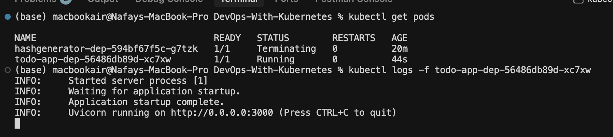

### Exercise 1.3. Declarative approach

- **Solution Submission**: [1.3](https://github.com/Nafay-0/DevOps-With-Kubernetes/tree/1.3)
- **Log output**:

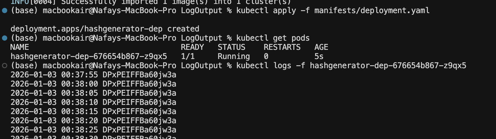

### Exercise 1.4. The project, step2

- **Solution Submission**: [1.4](https://github.com/Nafay-0/DevOps-With-Kubernetes/tree/1.4)
- **Log output**:
    No screenshot available. Only the manifests/deployment.yaml file is available.

### Exercise 1.5. The project, step3

- **Solution Submission**: [1.5](https://github.com/Nafay-0/DevOps-With-Kubernetes/tree/1.5)
- **Log output**:
- 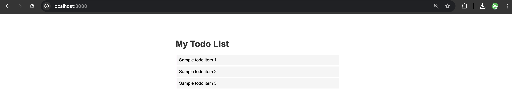
   

### Exercise 1.6. The project, step4

- **Solution Submission**: [1.6](https://github.com/Nafay-0/DevOps-With-Kubernetes/tree/1.6)
- **Log output**:
- 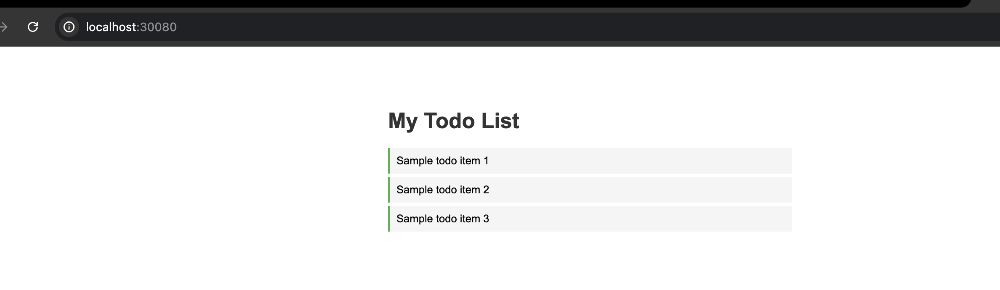

### Exercise 1.7. External access with Ingress

- **Solution Submission**: [1.7](https://github.com/Nafay-0/DevOps-With-Kubernetes/tree/1.7)
- **Log output**:
- 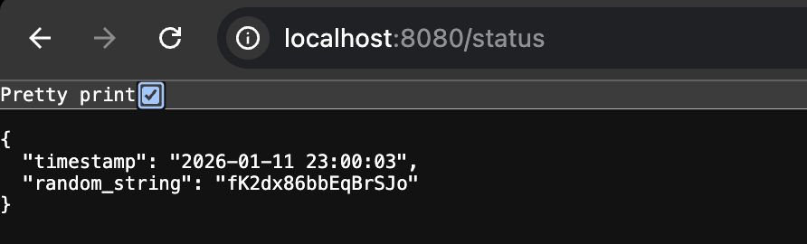

### Exercise 1.8. The project, step5

- **Solution Submission**: [1.8](https://github.com/Nafay-0/DevOps-With-Kubernetes/tree/1.8)
- **Log output**:
- 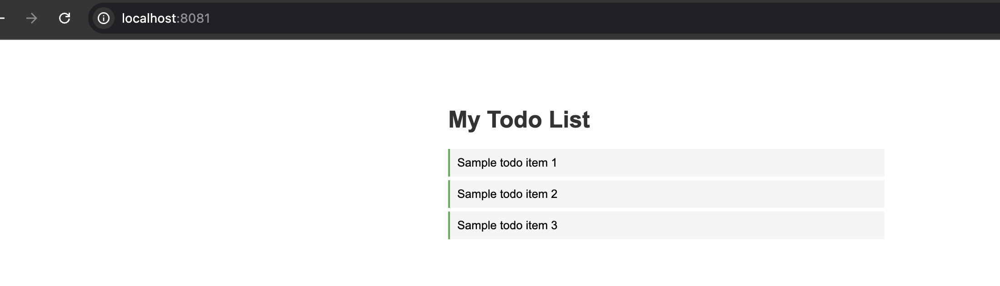

### Exercise 1.9. More services

- **Solution Submission**: [1.9](https://github.com/Nafay-0/DevOps-With-Kubernetes/tree/1.9)
- **Log output**:
- 

### Exercise 1.10. Even More services

- **Solution Submission**: [1.10](https://github.com/Nafay-0/DevOps-With-Kubernetes/tree/1.10)
- **Log output**:
- 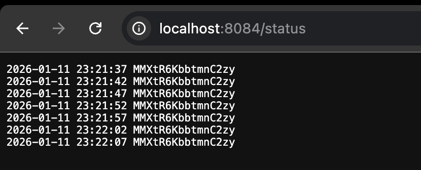

### Exercise 1.11. Persisting data

- **Solution Submission**: [1.11](https://github.com/Nafay-0/DevOps-With-Kubernetes/tree/1.11)
- **Log output**:
- 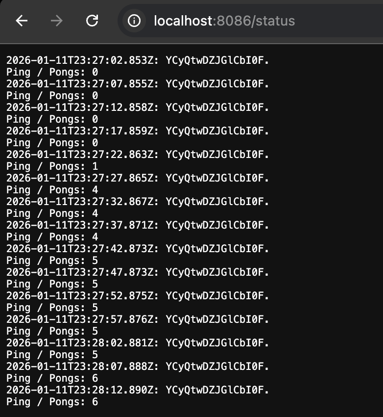
- 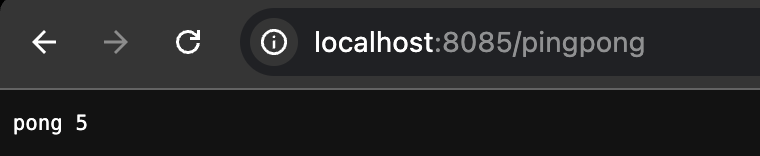

### Exercise 1.12. The project, step 6

- **Solution Submission**: [1.12](https://github.com/Nafay-0/DevOps-With-Kubernetes/tree/1.12)
- **Log output**:
- 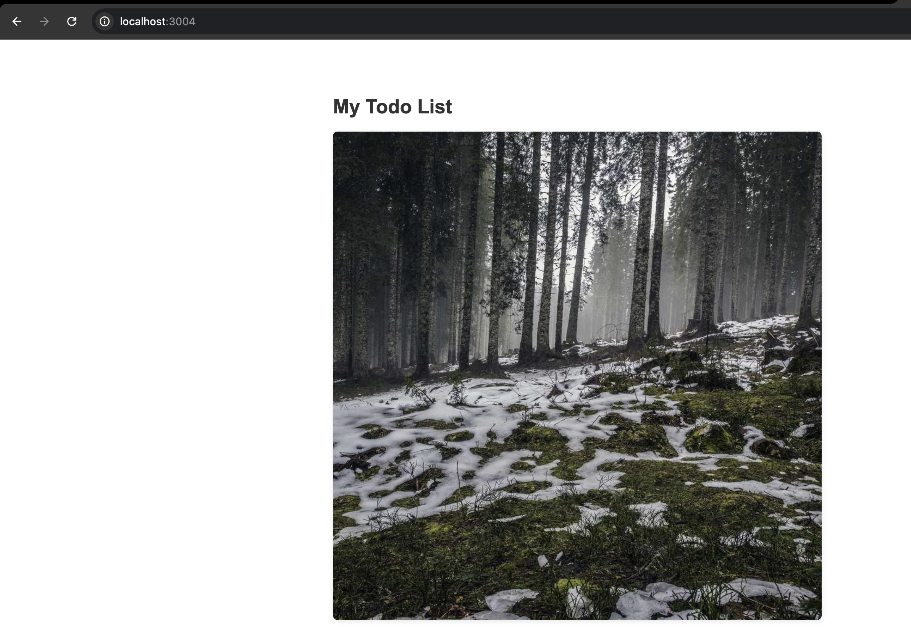

### Exercise 1.13 The project, step 7
- **Solution Submission**: [1.13](https://github.com/Nafay-0/DevOps-With-Kubernetes/tree/1.13)
- **Log output**:
- 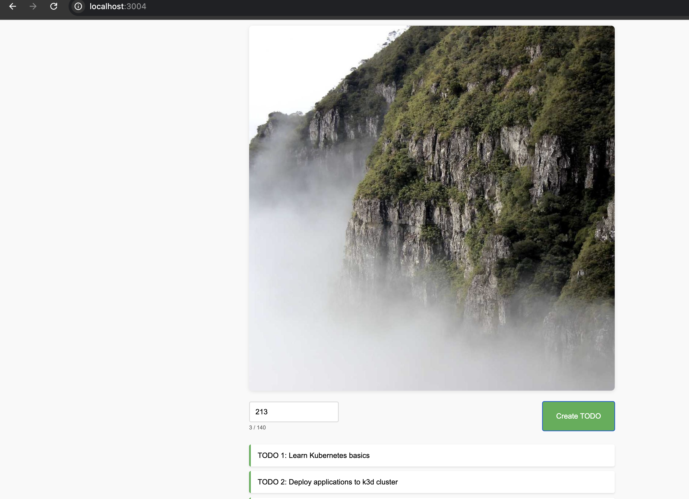

### Exercise 2.1 Connecting pods
- **Solution Submission**: [2.1](https://github.com/Nafay-0/DevOps-With-Kubernetes/tree/2.1)
