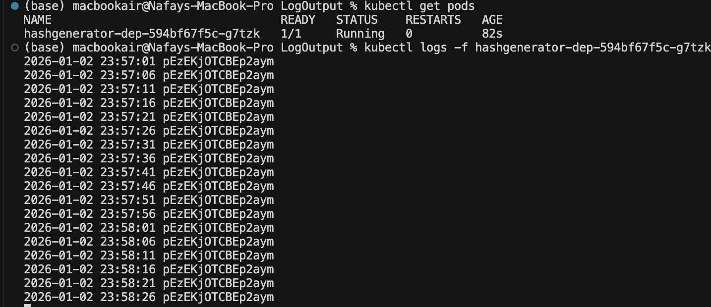

# DevOps-With-Kubernetes
GitHub repo containing solutions for the **DevOps with Kubernetes** course.

## Chapter 2

## Exercises

### Exercise 1.1 — Getting started

- **Solution Submission**: [1.1](https://github.com/Nafay-0/DevOps-With-Kubernetes/tree/1.1)
- **Log output**:

### Exercise 1.2. The project, step 1

- **Solution Submission**: [1.1](https://github.com/Nafay-0/DevOps-With-Kubernetes/tree/1.2)
- **Log output**:

